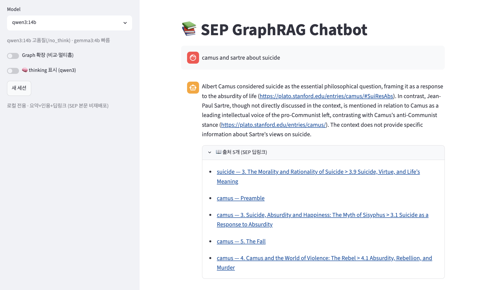
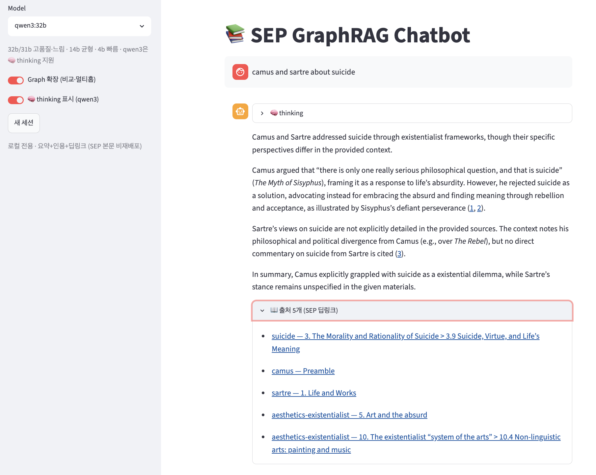
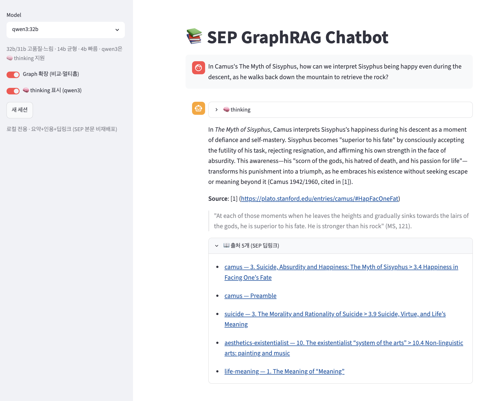
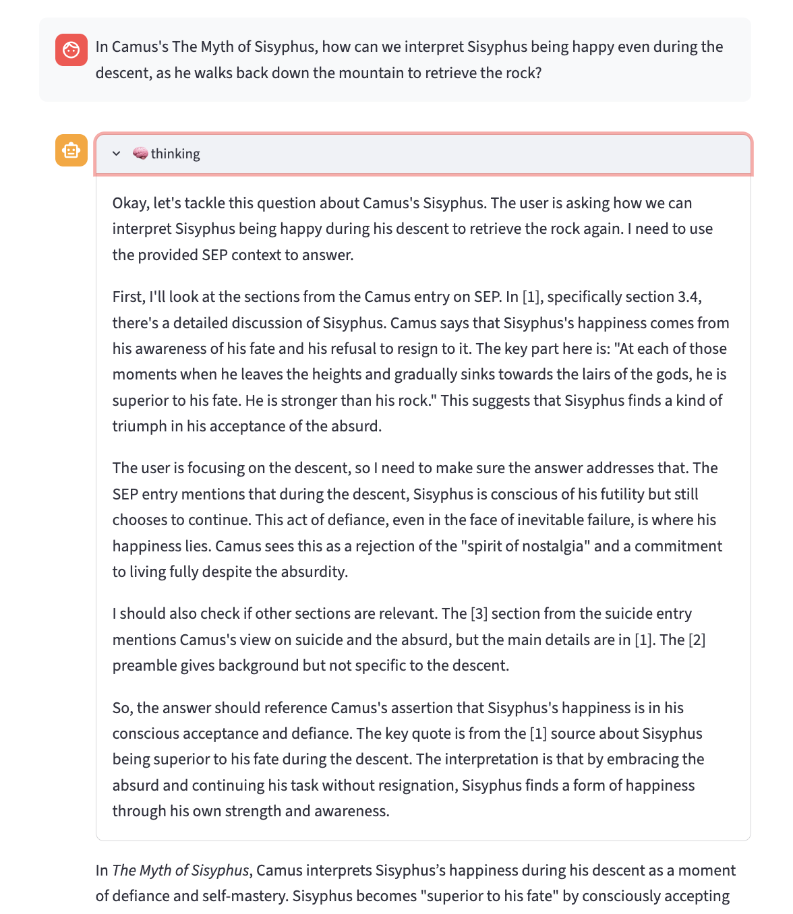
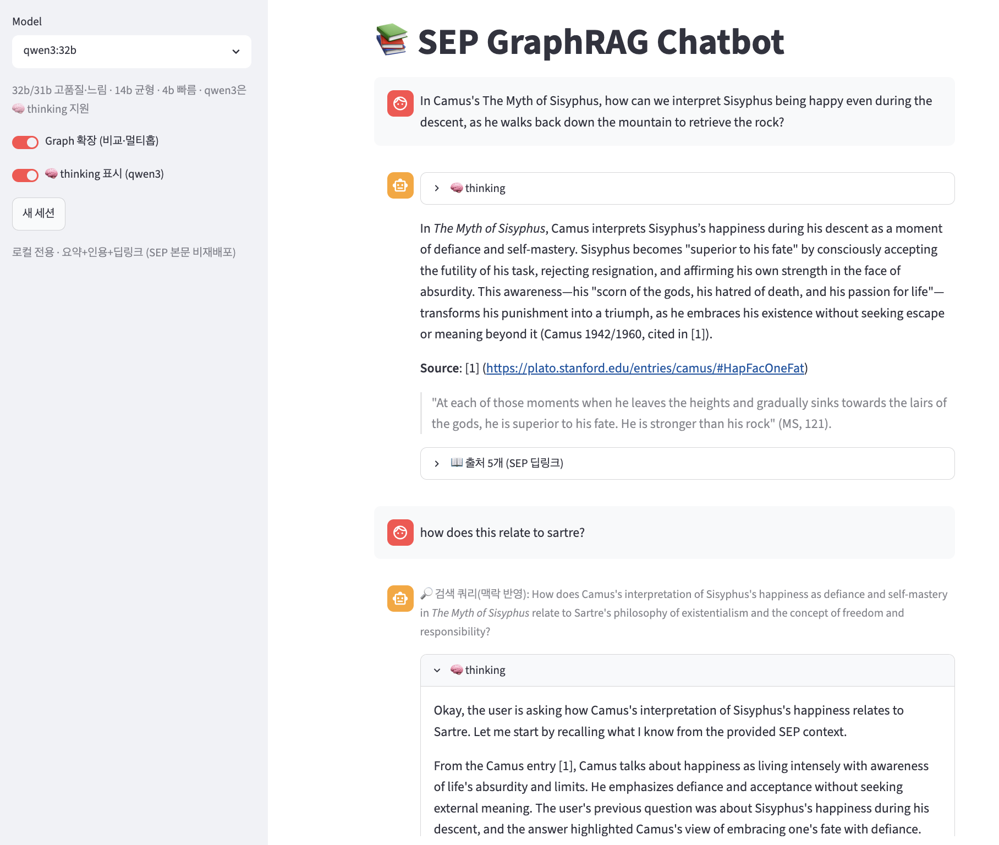
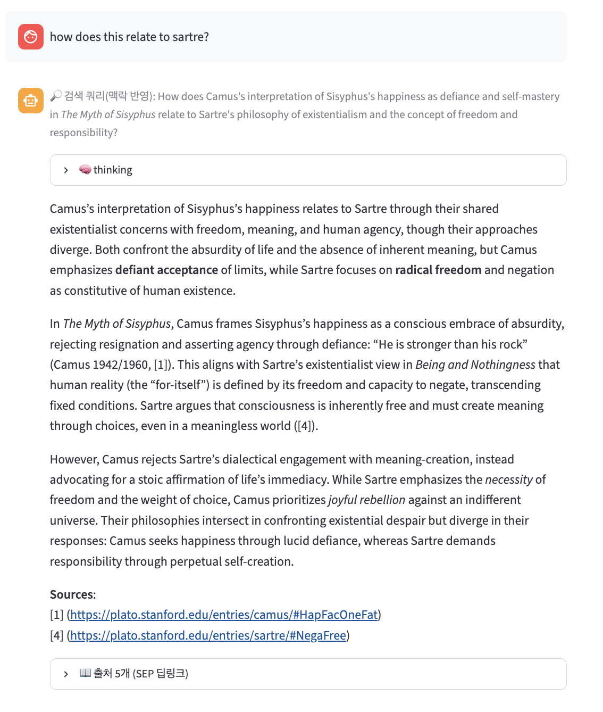
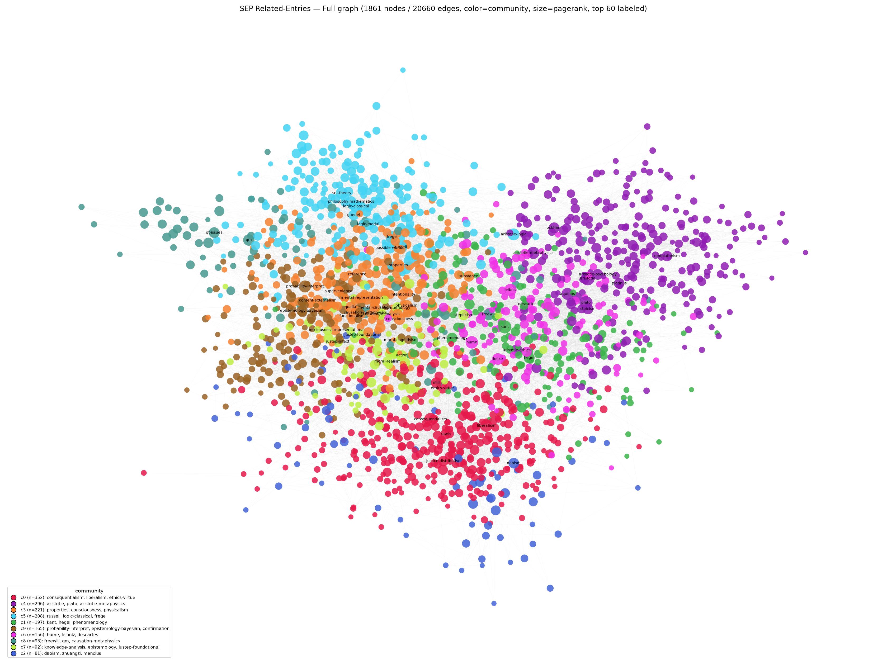
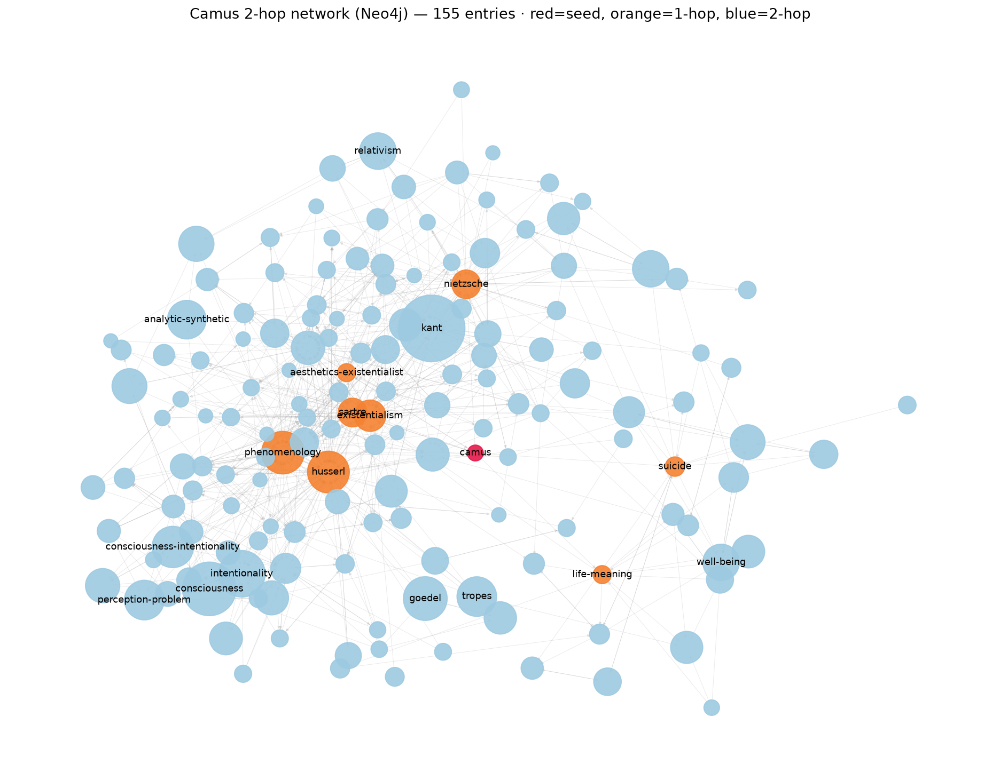

# SEP GraphRAG

Stanford Encyclopedia of Philosophy(SEP) 전체(약 1,861개 항목)를 로컬에서 검색하고 질문하는 RAG/GraphRAG 실험이다. 항목을 긁어 청킹·임베딩한 뒤, 벡터 검색 위에 리랭크와 small-to-big, 그리고 항목 사이의 Related Entries 그래프를 얹었다. "돌아간다"에서 멈추지 않고 직접 만든 평가셋으로 각 단계가 검색 품질을 실제로 올리는지 숫자로 확인했다.

목적은 두 가지였다. 철학 글을 자연어로 묻고 답마다 원문 섹션으로 바로 넘어가는 것, 그리고 스크래핑부터 UI까지 RAG 파이프라인을 직접 끝까지 짜보면서 그래프가 비교·멀티홉 질문에 얼마나 보탬이 되는지 재보는 것.

## 데이터는 포함하지 않는다

SEP 본문은 저작권이 살아있고 전자적 재배포가 금지돼 있다. 그래서 저장소에는 코드만 두고, 긁은 본문이나 청크, 벡터 인덱스는 커밋하지 않는다(`.gitignore`). robots.txt도 지켜서 `/archives/`는 건드리지 않고 라이브 `/entries/`만 요청 간 5초 간격으로 받는다. 직접 쓰려면 아래 스크래퍼로 본인이 받아야 한다. 챗봇 답변도 본문을 통째로 내보내지 않고 요약 + 짧은 인용 + 원문 링크로만 준다. 개인·로컬 사용을 전제로 한다.

## 멀티턴 대화

챗봇은 이전 대화를 기억한다. 한 항목을 물어본 뒤 "그럼 이걸 공리주의 관점에서 보면?"처럼 가리키는 말로 이어 물어도 맥락을 잡는다.

맥락은 두 군데서 쓴다.

첫째, 검색하기 전에 후속 질문을 직전 대화가 반영된 독립적인 질문으로 다시 쓴다. "이걸 공리주의로?"가 "카뮈의 부조리를 공리주의 관점에서 어떻게 보나?"로 바뀌는 식이다. 이렇게 해야 벡터 검색이 엉뚱한 데로 새지 않는다. 둘째, 답변을 만들 때 직전 대화를 프롬프트에 같이 넣어서 모델이 "이것/그것"이 뭘 가리키는지 알게 한다.

재작성은 가벼운 모델(gemma3:4b)로 빠르게 처리하고, 최종 답변만 고른 큰 모델이 만든다. 한국어나 중국어로 물으면 검색 질문은 영어(코퍼스가 영어라서)로 바뀌지만 답은 질문한 언어로 돌아온다. 자세한 동작은 [`Docs/conversational-rag.md`](./Docs/conversational-rag.md)에 정리해 뒀다.

## 빠르게 돌려보기

필요한 것은 macOS Apple Silicon(임베딩 MPS 가속, CPU도 되지만 느리다), Docker, Ollama(`ollama pull qwen3:14b gemma3:4b`), Python 3.11 + [uv](https://github.com/astral-sh/uv).

인덱스가 이미 있으면 챗봇만 띄우면 된다.

```bash
docker compose up -d qdrant neo4j
streamlit run 08_chatbot/app.py --server.fileWatcherType none   # http://localhost:8501
```

처음부터 재현하려면(스크래핑은 robots 준수로 약 2.8시간, 임베딩은 MPS에서 약 2.7시간 걸린다):

```bash
make setup                       # venv + 의존성
make up                          # Qdrant + Neo4j
make contents fetch meta graph   # 스크래핑 + 그래프
make chunk                       # 청킹 (small-to-big)
make embed index                 # 임베딩 + Qdrant 적재
make eval                        # 평가
make chat                        # 챗봇
```

`make help`로 전체 타깃을, `make healthcheck`로 서비스 상태를 볼 수 있다. 단계별 상세는 각 폴더의 README에, 작업 규칙은 [`CLAUDE.md`](./CLAUDE.md)에 있다.

## 파이프라인

단계를 번호 폴더로 나눴다: `02_scrape` → `03_chunk` → `04_embed` → `05_retrieve` → `06_qa` → `07_eval` → `08_chatbot`.

- **02_scrape** — 항목 1,861개와 메타데이터, Related Entries 그래프(노드 1,861 · 엣지 20,660 · 커뮤니티 10).
- **03_chunk** — child 152,611개 / parent 31,371개. 문단 단위로 자르되 검색은 작은 child로, 컨텍스트는 그 child가 속한 parent 섹션으로 돌려준다(small-to-big). 인용 딥링크는 97%가량 살아있다.
- **04_embed** — Qwen3-Embedding-0.6B(MPS fp16)로 임베딩해 Qdrant에 적재.
- **05_retrieve** — dense 검색 → Qwen3-Reranker → small-to-big 확장 → dedup. 비교 질문이면 그래프 1홉 이웃을 슬롯 예약으로 끼워 넣는다.
- **06_qa** — Ollama(qwen3:14b / gemma3:4b)로 요약 + 인용 + 딥링크 답변.
- **07_eval** — 직접 만든 24개 질문으로 측정. dense만 쓰면 hit@10이 0.67인데 리랭크를 붙이면 0.875로 오른다. 그래프는 비교 질문 커버리지를 0.571에서 0.643으로 올렸다.

벡터DB는 Qdrant, 임베딩/리랭크는 Qwen3, 생성은 Ollama, 그래프는 networkx·pyvis·Neo4j를 썼다. 4B/8B 임베더나 hybrid 검색은 0.6B + 리랭크로 충분해 보류했다. 평가 근거와 결정은 [`Docs/eval-design.md`](./Docs/eval-design.md), 전체 설계는 [`Docs/PLAN.md`](./Docs/PLAN.md)에 있다.

## 그래프

Related Entries 링크 자체가 방향 그래프다. `build_graph.py`로 edgelist와 커뮤니티, pyvis 시각화를 만들고, `to_neo4j.py`로 Neo4j에 넣으면 Cypher로 탐색할 수 있다.

```bash
docker compose up -d neo4j        # http://localhost:7474
python 02_scrape/023_graph_builder/to_neo4j.py
python 02_scrape/023_graph_builder/viz_neo4j.py   # schema.svg, camus_2hop.svg
```

스냅샷과 Cypher 예시는 [`02_scrape/023_graph_builder/README.md`](./02_scrape/023_graph_builder/README.md)에 있다.

## Use Case
1. camus and sartre about suicide

Graph 확장 없이(dense만, qwen3:14b):



Graph 확장 켜고(qwen3:32b) — Sartre 쪽 출처가 추가로 잡힌다:



2. In Camus's The Myth of Sisyphus, how can we interpret Sisyphus being happy even during the descent, as he walks back down the mountain to retrieve the rock?



qwen3의 thinking 과정도 펼쳐볼 수 있다:




3. 멀티턴 — "how does this relate to sartre?" 같은 후속 질문을 이전 맥락을 반영한 검색 쿼리로 재작성한다





4. graph

전체 그래프(1,861 노드):



부분 확대:



## 라이선스

코드는 MIT([`LICENSE`](./LICENSE)). SEP 본문은 저작권이 별개라 저장소에 없고 MIT도 적용되지 않는다. 저자와 Stanford Metaphysics Research Lab의 저작물이며, 코퍼스는 직접 스크래핑해서 로컬에서만 쓴다.
